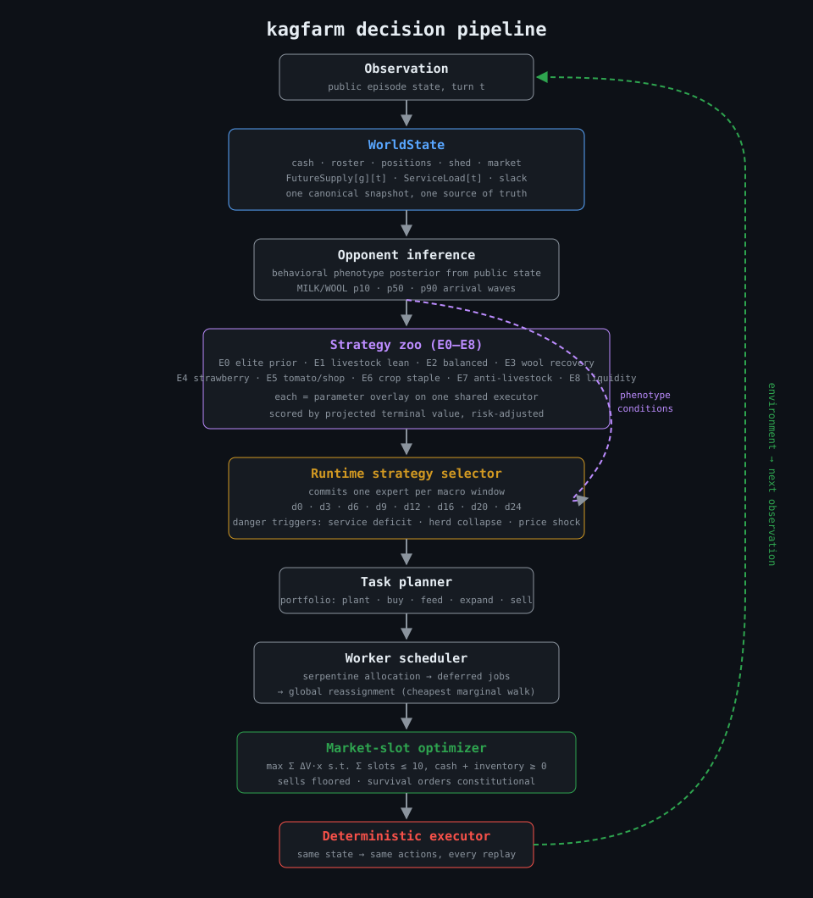

# 🌾 kagfarm — a competitive agent for Kaggle's Kaggriculture

An autonomous agent that plays a two-player farming economy game, plus the evaluation
infrastructure I built to find out, honestly, whether each change made it better.

<!-- Add once a workflow exists:  -->

[](https://www.kaggle.com/competitions/kaggriculture)

<!-- TODO (delete this comment when done): add a screenshot or GIF of a match here, e.g.
 -->

## In one paragraph

In Kaggriculture, two agents each run a farm for a 30-day season (720 turns): planting
crops, raising livestock, hiring workers, expanding land and trading on a **market they
share**. The agent holding more coins at the end wins. Every action costs time, and the
rival's production moves the same prices you sell into. `kagfarm` is my agent for it. It
observes the game, models the opponent, picks a strategy, schedules workers, and packs
its market orders under a hard slot limit. Around it I built a local rules engine, a
bridge to the real competition engine, ~78 experiment scripts, a 226-test suite, and a
written ledger of every experiment, including the ones that failed.

<!-- TODO: add one headline result in plain words, e.g.
"Reached rank N / Elo X on the public ladder after 31 submissions." -->

## Results

All numbers below come from the repository's own evaluation against the real competition
engine (v1.32.7) with a fixed random seed. They measure **wins and losses against
specific opponent agents**, not the official leaderboard.

**Latest shipped build, by opponent tier**

| Opponent tier        | Wins–Losses | Mean margin (coins) | Note                                      |
| -------------------- | ----------- | ------------------- | ----------------------------------------- |
| Elite (3 opponents)  | 0–3         | −80,941             | Smallest losses I've recorded on this tier |
| Famine (2)           | 2–0         | +45,256             | Best result so far                        |
| Midfield (4)         | 4–0         | +24,260             |                                           |
| Wall (7)             | 2–5         | −12,670             | Up from 1–6 after the scheduler fix       |

**Public ladder sample (25 episodes):** 14 wins, 11 losses, mean margin +4,521.
Against lower-rated opponents (below 540 Elo) it went 13–2 with a mean margin of +26k.
Against higher-rated ones (above 600) it went 0–5 with a mean margin of −40k. I traced
that ceiling, episode by episode, to the herd-service collapses described in
[What I'd do next](#what-id-do-next).

I treat **win/loss as the promotion metric and margin only as a tiebreaker**. Margin
can look like progress when it isn't (see [Measurement](#measurement)).

## How the agent decides

One shared picture of the game state feeds a layered decision pipeline:

```
Observation
    ↓
WorldState ──────────── one snapshot: cash, workers, positions, shed, market,
    │                   forecast supply, service load, slack
    ↓
Opponent inference ──── estimates the rival's behavior type from public state
    ↓
Strategy zoo ────────── nine parameter sets (E0–E8) over one executor
    ↓
Runtime selector ────── commits one strategy per time window, with
    │                   emergency overrides for danger signals
    ↓
Task planner ────────── plant, buy, feed, expand, sell
    ↓
Worker scheduler ────── assigns jobs to minimize walking
    ↓
Market-slot optimizer ─ best orders under a 10-slot-per-turn limit
    ↓
Deterministic executor
```



### Five ideas that mattered

1. **One shared world state.** Planners that each interpreted the raw observation
   quietly disagreed with each other. The market model and the allocator used the same
   function with different weighting, and the mismatch survived two submissions before a
   shared-state rewrite exposed it. Now every subsystem reads one forecast object.
2. **Strategy selection at runtime.** Instead of committing to one strategy, the agent
   scores nine at decision points and commits to the winner for a window, unless a danger
   trigger (service deficit, herd-collapse risk, price shock) fires first.
3. **The opponent as a market force.** I can't control the rival, but their herd moves
   the shared price. The agent estimates their behavior type and prices its own livestock
   decisions partly on their expected milk and wool output.
4. **Worker scheduling as optimization.** Every turn spent walking is a turn not
   producing. A global reassignment pass hands deferred jobs to whichever worker has the
   cheapest extra walk. This one change turned a lost matchup (−$22,109) into a win
   (+$12,749) without touching strategy.
5. **Market slots as a constrained problem.** Ten order slots per turn are shared between
   buys and sells. The agent re-packs discretionary orders by value per slot, while
   survival orders (hiring, land) always keep priority.

## Measurement

Tooling is the main deliverable here. Every new mechanism ships behind a flag, stays off
until a real-engine battery shows it helps, and gets a row in the
[ledger](calibration/live.md) whatever the outcome. Two results shaped how I work:

- **A "catastrophic −$115,914 regression" was a measurement bug.** The flag under test
  hit an outdated function call, crashed inside a guard that swallowed the error, and made
  the agent pass on every action. After fixing the call, the real effect was neutral. I
  invalidated the ledger row instead of deleting it.
- **A +38% margin gain changed no win/loss results**, and one opponent tier got worse in
  the same build. That's why wins and losses, not margin, decide what ships.

Reproducibility is built in: the hash seed is pinned (`PYTHONHASHSEED=0`) because a tiny
change can reroute a 720-turn game, and the packaging step replays 16 reference episodes
and refuses to ship if they don't check out (`PACK OK 16/16`).

## Run it

```bash
bash bootstrap.sh                                                     # venv + pinned deps + vendored engine
PYTHONHASHSEED=0 .venv/bin/python -m unittest discover -s tests -q   # 226 tests
PYTHONHASHSEED=0 PYTHON="$PWD/.venv/bin/python" SEEDS=8 bash pack.sh # build + validate the submission
```

Local evaluation runs the agent against the vendored competition engine through
`bridge/real_env.py`. The scripts in `analysis/` (`judge_bar.py`,
`paired_harness_real.py`, `zoo_rollout.py`, …) run the batteries.

Some Kaggle assets (the engine itself and multi-GB replay datasets) aren't committed.
`bootstrap.sh` re-vendors the engine and `analysis/restore_replays.py` re-fetches replays.

## Repository map

```
main.py                  competition entry point
kagfarm/
  policy.py              the agent: world state, strategy zoo, selector, planners
  route.py               worker scheduling
  constants.py           game tables and feature-flag defaults
  opening_book*.json     precomputed opening sequences
engine.py                my local reimplementation of the game rules
eval.py / sweep.py       local evaluation and parameter sweeps
bridge/real_env.py       evaluation through the real competition engine
analysis/                ~78 experiment scripts (A/B panels, forensics, rollouts)
calibration/live.md      the ledger: every experiment, gate and number
tests/                   226 unit tests
bundle.py / pack.sh      single-file bundling and validated packaging
```

## What I learned

- **Good heuristics need adversarial measurement.** Strategies that looked clearly better
  lost once the opponent pool widened.
- **State representation is the leverage point.** The shared-forecast rewrite found real
  bugs that weeks of local reasoning had missed, including a day-0 falsy-value bug in the
  opponent calendar.
- **Optimization is always constrained.** The question is never "what's the best action"
  but "what's the best action given time, labor, cash, shed capacity and the rival's next
  ten production waves.
- **Robustness beats a clever trick.** A mechanism that wins one matchup and loses
  another is worth less than a neutral one that removes a failure mode.

## What I'd do next

- **Fix the ceiling against strong opponents.** Losses above 600 Elo trace to herds
  collapsing when workers can't keep up with feeding and care. The service-slack model
  targets this; the next step is testing it on the elite tiers.
- **Arm the strategy selector.** It ships switched off, pending a head-to-head panel on
  the elite and wall tiers.
- **Look ahead 24 to 96 turns** using rollouts over the shared world state.
- **Richer opponent modelling**, and self-play against a pool of opponents to discover
  strategies automatically.

## Competition and licensing

Built for [Kaggriculture on Kaggle](https://www.kaggle.com/competitions/kaggriculture).
Game engine and assets belong to their respective owners.

<!-- TODO: add a LICENSE file and state it here, after checking what the vendored engine allows. -->
